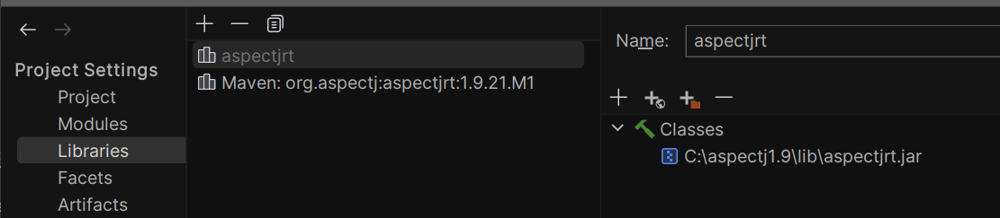

## Activité Pratique AOP

# Étapes et prérequis généraux :

# Configuration d'AspectJ dans IntelliJ IDEA

# 1. Téléchargement d'AspectJ

[site officiel d'AspectJ](https://www.eclipse.org/aspectj/)

> Le téléchargement d'AspectJ depuis le site officiel vous donne accès aux bibliothèques et aux outils nécessaires pour utiliser AOP dans votre projet.

# 2. Ajout du fichier JAR à votre projet IntelliJ IDEA
 
>  Le fichier JAR téléchargé contient les bibliothèques d'AspectJ. En ajoutant ce fichier JAR à votre projet IntelliJ IDEA, vous permettez à votre projet d'accéder aux fonctionnalités d'AspectJ.

# 3. Ajout de la dépendance AOP dans le fichier pom.xml

> Cette étape concerne les projets Maven. En ajoutant la dépendance AspectJ dans le fichier pom.xml, vous indiquez à Maven d'inclure la bibliothèque AspectJ lors de la construction du projet.

```xml
<dependency>
    <groupId>org.aspectj</groupId>
    <artifactId>aspectjrt</artifactId>
    <version>1.9.21.M1</version>
    <scope>runtime</scope>
</dependency>
```

# 4. Ajout de facets d'AspectJ

> AspectJ nécessite une configuration spécifique dans IntelliJ IDEA. En ajoutant les facets d'AspectJ, vous indiquez à l'IDE que votre projet utilise AspectJ. Cela permet à IntelliJ de fournir une prise en charge spécifique pour les fonctionnalités d'AspectJ.

# 5. Configuration du compilateur AspectJ

>  AspectJ utilise un compilateur spécifique. La configuration du compilateur AspectJ dans les paramètres du projet permet à IntelliJ IDEA de reconnaître et de traiter correctement les aspects lors de la compilation du code source. 