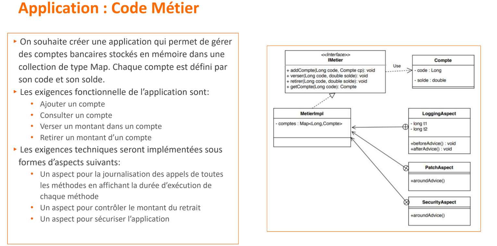
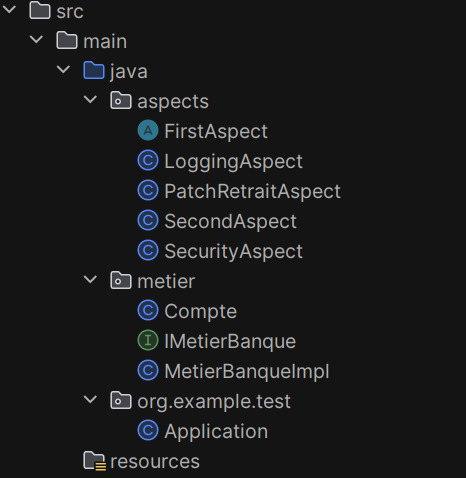
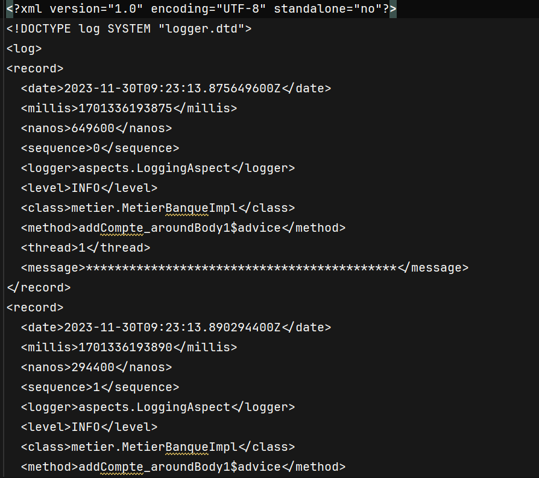
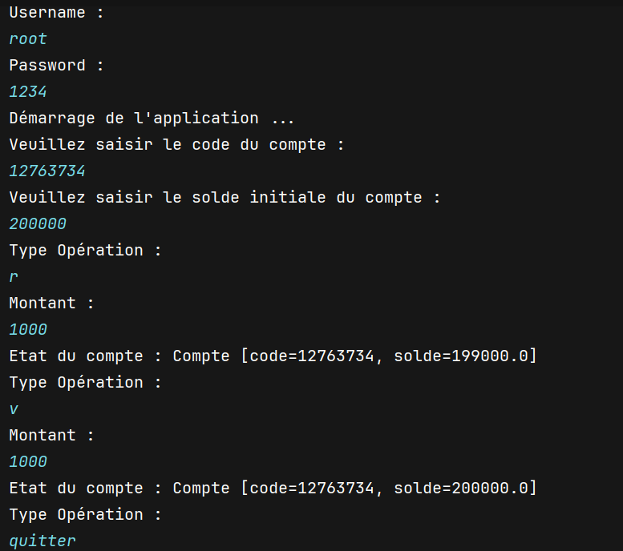

#  🔗  Activité Pratique AOP (AspectJ)

<ul>
<li> Étapes et prérequis généraux (Configuration d'AspectJ dans IntelliJ IDEA)</li>
<li> Partie I En utilsant AspectJ</li>
<li> Partie II En utilsant Spring AOP</li>
</ul>

# Étapes et prérequis généraux (Configuration d'AspectJ dans IntelliJ IDEA)
## 1. Téléchargement d'AspectJ

[site officiel d'AspectJ](https://www.eclipse.org/aspectj/)

> Le téléchargement d'AspectJ depuis le site officiel vous donne accès aux bibliothèques et aux outils nécessaires pour utiliser AOP dans votre projet.

## 2. Ajout du fichier JAR à votre projet IntelliJ IDEA
 
>  Le fichier JAR téléchargé contient les bibliothèques d'AspectJ. En ajoutant ce fichier JAR à votre projet IntelliJ IDEA, vous permettez à votre projet d'accéder aux fonctionnalités d'AspectJ.

## 3. Ajout de la dépendance AOP dans le fichier pom.xml

> Cette étape concerne les projets Maven. En ajoutant la dépendance AspectJ dans le fichier pom.xml, vous indiquez à Maven d'inclure la bibliothèque AspectJ lors de la construction du projet.

```xml
<dependency>
    <groupId>org.aspectj</groupId>
    <artifactId>aspectjrt</artifactId>
    <version>1.9.21.M1</version>
    <scope>runtime</scope>
</dependency>
```


## 4. Ajout de facets d'AspectJ

> AspectJ nécessite une configuration spécifique dans IntelliJ IDEA. En ajoutant les facets d'AspectJ, vous indiquez à l'IDE que votre projet utilise AspectJ. Cela permet à IntelliJ de fournir une prise en charge spécifique pour les fonctionnalités d'AspectJ.


## 5. Configuration du compilateur AspectJ

>  AspectJ utilise un compilateur spécifique. La configuration du compilateur AspectJ dans les paramètres du projet permet à IntelliJ IDEA de reconnaître et de traiter correctement les aspects lors de la compilation du code source. 


# Partie I En utilsant AspectJ


**Architecture**


## **Entité _Compte_**
> Une classe Java Compte représentant un compte bancaire. 

```java
public class Compte {
    private Long code;
    private double solde;

    public Compte(Long code, double solde) {
        this.code = code;
        this.solde = solde;
    }

    public Long getCode() {
        return code;
    }

    public void setCode(Long code) {
        this.code = code;
    }

    public double getSolde() {
        return solde;
    }

    public void setSolde(double solde) {
        this.solde = solde;
    }

    @Override
    public String toString() {
    	return "Compte [code=" + code + ", solde=" + solde + "]";
    }
}
```

## **Interface _IMetierBanque_**

> Cette interface Java IMetierBanque déclare des méthodes pour gérer les comptes bancaires, telles que l'ajout d'un compte, le dépôt d'argent, le retrait d'argent et la vérification du solde d'un compte.

```java
public interface IMetierBanque {
    void addCompte(Compte compte);
    void verser(Long code,double montant);
    void retirer(Long code,double montant);
    Compte consulter(Long code);
}
```

## **Implémentation _MetierBanqueImpl_**

> La classe MetierBanqueImpl implémente l'interface IMetierBanque. Elle utilise une Map pour stocker les comptes et fournit des implémentations pour l'ajout d'un compte, le dépôt d'argent, le retrait d'argent et la vérification du solde d'un compte.

```java
public class MetierBanqueImpl implements IMetierBanque {
    private Map<Long, Compte> compteMap=new HashMap<>();
    @Override
    public void addCompte(Compte compte) {
         compteMap.put(compte.getCode(),compte);
    }

    @Override
    public void verser(Long code, double montant) {
          Compte compte=compteMap.get(code);
          compte.setSolde(compte.getSolde()+montant);
    }

    @Override
    public void retirer(Long code, double montant) {
        Compte compte=compteMap.get(code);
        compte.setSolde(compte.getSolde()-montant);

    }

    @Override
    public Compte consulter(Long code) {
        return compteMap.get(code);
    }
}
```
## **Aspect _FirstAspect_**

> Cet aspect AspectJ, FirstAspect, intercepte l'exécution de la méthode main de la classe org.example.test.Application. Il comprend des conseils before, after et around. 

```java
public aspect FirstAspect {
    pointcut pc1(): execution(* org.example.test.Application.main(..));

    before(): pc1(){
        System.out.println("-------------------------------------------");
        System.out.println("Before main from Aspect with AspectJ syntax");
        System.out.println("-------------------------------------------");
    }

    after(): pc1(){
        System.out.println("-------------------------------------------");
        System.out.println("After main from Aspect with AspectJ syntax");
        System.out.println("-------------------------------------------");
    }
    void around(): pc1(){
        System.out.println("-------------------------------------------");
        System.out.println("Before main from Aspect with AspectJ syntax");
        System.out.println("-------------------------------------------");
        // Exécution de l'opération du pointcut
        proceed();
        System.out.println("-------------------------------------------");
        System.out.println("After main from Aspect with AspectJ syntax");
        System.out.println("-------------------------------------------");

    }
}
```

## **Aspect _SecondAspect_**

> Cet aspect AspectJ, SecondAspect est une implémentation alternative pour intercepter la méthode main en utilisant des annotations. 

```java
@Aspect
public class SecondAspect {
    @Pointcut("execution(* org.example.test.*.main(..))")
    public void pc1(){

    }
   /* @Before("pc1()")
    public void beforeMain(){
        System.out.println("*******************************************");
        System.out.println("Before main from Aspect with Class syntax");
        System.out.println("*******************************************");
    }
    @After("pc1()")
    public void afterMain(){
        System.out.println("*******************************************");
        System.out.println("After main from Aspect with Class syntax");
        System.out.println("*******************************************");
    }*/

    @Around("pc1()")
    public void arroundMain(ProceedingJoinPoint proceedingJoinPoint) throws Throwable {
        System.out.println("*******************************************");
        System.out.println("Before main from Aspect with Class syntax");
        System.out.println("*******************************************");
        // Exécution la méthode main
        proceedingJoinPoint.proceed();
        System.out.println("*******************************************");
        System.out.println("After main from Aspect with Class syntax");
        System.out.println("*******************************************");
    }
}
```
## **Aspect _LoggingAspect_**

> Cet aspect AspectJ, LoggingAspect, enregistre l'exécution des méthodes de la classe MetierBanqueImpl. Il enregistre l'heure avant et après l'exécution de la méthode et calcule la durée. Les journaux sont écrits dans un fichier nommé "log.txt".

```java
@Aspect
public class LoggingAspect {
    //@Pointcut("call(* metier.MetierBanqueImpl.*(..))")
    //long t1;
    Logger logger = Logger.getLogger(LoggingAspect.class.getName());
    public LoggingAspect() throws IOException {
        logger.addHandler(new FileHandler("log.txt"));
        logger.setUseParentHandlers(false);
    }
   @Pointcut("execution(* metier.MetierBanqueImpl.*(..)) || initialization(metier.MetierBanqueImpl.new(..))")
    public void pc1() {
    }
 /*
    @Before("pc1()")
    public void avant(JoinPoint joinPoint) {
        t1 = System.currentTimeMillis();
        logger.info("*******************************************");
        logger.info("Avant l'exécution de la méthode : " + joinPoint.getSignature().getName());
    }

    @After("pc1()")
    public void apres(JoinPoint joinPoint) {
        logger.info("Après l'exécution de la méthode : " + joinPoint.getSignature().getName());
        logger.info("Durée d'exécution de la méthode : " + (System.currentTimeMillis() - t1) + " ms");
        logger.info("*******************************************");
    }*/

    @Around("pc1()")
    public Object autour(ProceedingJoinPoint proceedingJoinPoint,JoinPoint joinPoint) throws Throwable {
        long t1 = System.currentTimeMillis();
        logger.info("*******************************************");
        logger.info("Avant l'exécution de la méthode : " + joinPoint.getSignature().getName());
        Object o=proceedingJoinPoint.proceed();
        logger.info("Après l'exécution de la méthode : " + joinPoint.getSignature().getName());
        logger.info("Durée d'exécution de la méthode : " + (System.currentTimeMillis() - t1) + " ms");
        logger.info("*******************************************");
        return o;
    }
}
```

## **Fichier log.txt**


## **Aspect _PatchRetraitAspect_**

> Cet aspect AspectJ, PatchRetraitAspect, intercepte la méthode retirer de la classe MetierBanqueImpl. Il vérifie si le solde du compte est suffisant avant d'autoriser un retrait et lève une RuntimeException si le solde est insuffisant.

```java
@Aspect
public class PatchRetraitAspect {
    @Pointcut("execution(* metier.MetierBanqueImpl.retirer(..))")
    public void pc1() {
    }

    @Around("pc1() && args(code,montant)")
    public Object autourRetirer(Long code,double montant,ProceedingJoinPoint proceedingJoinPoint, JoinPoint joinPoint){
        MetierBanqueImpl metierBanque = (MetierBanqueImpl) proceedingJoinPoint.getTarget();
        Compte compte=metierBanque.consulter(code);
        if(compte.getSolde()<montant) throw new RuntimeException("Solde insuffisant");
        else {
            Object o= null;
            try {
                o = proceedingJoinPoint.proceed();
            } catch (Throwable throwable) {
                throwable.printStackTrace();
            }
            return o;
        }
    }
}
```
## **Aspect _SecurityAspect_**

> Cet aspect AspectJ, SecurityAspect, intercepte la méthode start de la classe Application. Il demande à l'utilisateur un nom d'utilisateur et un mot de passe, permettant l'accès à l'application uniquement si les informations d'identification fournies correspondent aux valeurs attendues.

```java
@Aspect
public class SecurityAspect {
    @Pointcut("execution(* org.example.test.Application.start(..))")
    public void startAppPointcut() {
    }

    @Around("startAppPointcut()")
    public void autourStartApp(ProceedingJoinPoint proceedingJoinPoint, JoinPoint joinPoint) throws Throwable {
        Scanner scanner = new Scanner(System.in);
        System.out.println("Username : ");
        String username = scanner.next();
        System.out.println("Password : ");
        String password = scanner.next();
        if (username.equals("root") && password.equals("1234")){
            proceedingJoinPoint.proceed();
        }else {
            System.out.println("Access Denied ...");
        }
    }
}
```
## **Application _main_**

> La classe Application contient la méthode main, qui sert de point d'entrée de l'application. Elle permet aux utilisateurs de créer interactivement un compte bancaire, d'effectuer des opérations de dépôt et de retrait, et de consulter l'état du compte. L'application continue jusqu'à ce que l'utilisateur décide de quitter. Il existe également une vérification de sécurité simple mise en œuvre dans la méthode start en utilisant l'aspect SecurityAspect.

```java
public class Application {
    public static void main(String[] args) {
        new Application().start();
    }

    private void start() {
        System.out.println("Démarrage de l'application ...");
        Scanner scanner = new Scanner(System.in);
        System.out.println("Veuillez saisir le code du compte : ");
        Long code = scanner.nextLong();
        System.out.println("Veuillez saisir le solde initiale du compte : ");
        double solde = scanner.nextDouble();
        IMetierBanque metierBanque = new MetierBanqueImpl();
        metierBanque.addCompte(new Compte(code, solde));
        while (true){
            try {
                System.out.println("Type Opération : ");
                String type = scanner.next();
                if(type.equals("quitter")) break;
                System.out.println("Montant :");
                double montant = scanner.nextDouble();
                if (type.equals("v")) {
                    metierBanque.verser(code, montant);
                } else if (type.equals("r")) {
                    metierBanque.retirer(code, montant);
                }
                Compte compte = metierBanque.consulter(code);
                System.out.println("Etat du compte : " + compte.toString());
            }catch (Exception e){
                System.out.println(e.getMessage());
            }
        }
        System.out.println("Fin de l'application");
    }
}
```

## **Exécution**

